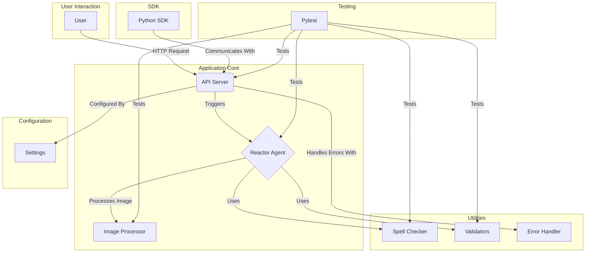

# NanozillA


[](https://github.com/your-username/NanozillA/actions/workflows/python-app.yml)
[](https://github.com/your-username/NanozillA/actions/workflows/codeql.yml)
[](https://github.com/your-username/NanozillA/actions/workflows/test.yml)
[](https://opensource.org/licenses/MIT)

NanozillA is a Python-based application that provides a core API server, image processing capabilities, and a reactor agent. It is designed to be a flexible and extensible platform for building a variety of applications.

## Overview

This project is a Python application that provides a simple and efficient way to process images. It includes an API server that can be used to trigger image processing tasks, and a reactor agent that can be used to process images in the background. The project also includes a set of utilities for spell checking, validation, and error handling.

## Features

- **API Server:** A simple and efficient API server that can be used to trigger image processing tasks.
- **Reactor Agent:** A reactor agent that can be used to process images in the background.
- **Image Processor:** A set of tools for processing images.
- **Utilities:** A set of utilities for spell checking, validation, and error handling.

## Getting Started

### Prerequisites

- Python 3.9+
- pip
- virtualenv

### Installation

1. Clone the repository:
   ```bash
   git clone https://github.com/your-username/NanozillA.git
   ```
2. Navigate to the project directory:
   ```bash
   cd NanozillA
   ```
3. Create a virtual environment:
   ```bash
   python -m venv venv
   ```
4. Activate the virtual environment:
   - On Windows:
     ```bash
     venv\Scripts\activate
     ```
   - On macOS and Linux:
     ```bash
     source venv/bin/activate
     ```
5. Install the dependencies:
   ```bash
   pip install -r requirements.txt
   ```
6. Create a `.env` file and add your environment variables. You can use the `.env.example` file as a template.

## Usage

To start the API server, run the following command:

```bash
python app.py
```

This will start the API server on port 5000. You can then send requests to the API server to trigger image processing tasks.

## Testing

To run the tests for this project, you will need to have `pytest` installed. You can install it with the following command:

```bash
pip install pytest
```

Once you have `pytest` installed, you can run the tests with the following command:

```bash
pytest
```

You can also run the tests with coverage using the following command:

```bash
pytest --cov=core --cov-report=html
```

This will generate a coverage report in the `htmlcov` directory.

## Architecture

The architecture of this project is designed to be simple and scalable. It is divided into three main components:

- **API Server:** The API server is responsible for handling incoming requests and triggering image processing tasks.
- **Reactor Agent:** The reactor agent is responsible for processing images in the background.
- **Utilities:** The utilities are a set of tools for spell checking, validation, and error handling.

The following diagram illustrates the architecture of the project:



## Contributing

We welcome contributions to NanozillA!

Please read our [CONTRIBUTING.md](CONTRIBUTING.md) for details on our code of conduct, and the process for submitting pull requests to us. We use GitHub issues to track public bugs. Please ensure your description is clear and has sufficient instructions to be able to reproduce the issue.

## License

This project is licensed under the MIT License - see the [LICENSE](LICENSE) file for details.

This project is open source and available to everyone.